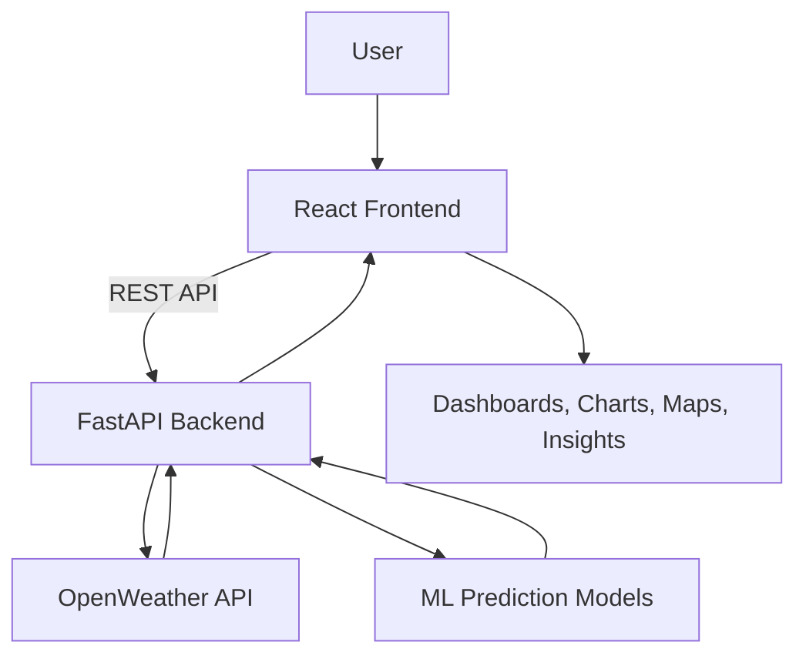

# System Architecture

```mermaid
flowchart TD
    U[User] --> F[React Frontend]
    F -->|REST API| B[FastAPI Backend]
    B --> W[OpenWeather API]
    B --> M[ML Prediction Models]
    M --> B
    W --> B
    B --> F
    F --> V[Dashboards, Charts, Maps, Insights]
```

